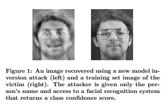

# Privacy PyTorch

## 들어가기 전. 딥러닝과 정보보호

*딥러닝*은 현재 가장 각광받고 있는 기술이며, 시각(Vision) 및 청각(Audio)에 이르기까지 다양한 분야에 걸쳐 개발이 진행되고 있습니다. 그 무한한 가능성에 많은 학자들에 의해 활발하게 연구되고 있으며, 자율주행 자동차부터 인공지능 스피커까지 우리 앞에 제품으로도 모습을 드러내고 있습니다.

그런데 만약 악의를 품은 누군가가 딥러닝을 통해 관련 정보를 추출할 수 있다면 어떻게 될까요? 예를 들면, 자율주행 자동차의 모델로부터 내 행동패턴을 추출한다거나, 인공지능 스피커에서 내 목소리를 빼내는 등...

개인정보가 중요시되는 지금, 딥러닝 모델과 정보보호는 어떤 관계가 있을지 알아봅니다.

### 정보보호와 프라이버시 공격(Privacy Attack)

딥러닝은 다수의 데이터(Data)를 기반으로 학습(Training)하는 방법입니다. 따라서, 딥러닝은 학습 데이터(Training Data)의 정보를 가득 담고 있다고 해도 과언이 아닙니다. 조금 과장하자면, *딥러닝 모델은 학습 데이터 그 자체*라고 할 수도 있겠습니다. 따라서, 가능한 *정보 추출 공격*으로부터 모델을 보호하는 것은 매우 중요한 과제입니다. 

**프라이버시 공격**은 위에서 언급한 것과 같이 모델로부터 정보를 추출해내는 공격을 의미합니다. 추출 대상인 정보에 따라서 다음과 같이 공격을 나눌 수 있습니다.

* **Model Inversion Attack**: 모델이 기억하는 정보(e.g., 학습 데이터)를 복원하는 공격.
* **Model Extraction Attack**: 훈련된 모델을 탈취하는 공격.
* **Membership Inference Attack**: 학습 과정에서 특정 데이터가 학습에 사용되었는지 여부를 추출하는 공격.

**Model Inversion Attack**은 모델이 담고있는 정보 그 자체를 복원하는 공격입니다. 앞서 언급했던 것과 같이, 모델은 학습 데이터의 정보를 담고 있어 모델로부터 학습 데이터를 복원할 수도 있다는 것이 밝혀졌습니다. 아래 그림은 모델로부터 특정 인물의 사진을 거의 비슷하게 복원한 Model Inversion Attack을 보여줍니다.

> [추천 논문]
>
> Model Inversion Attacks That Exploit Confidence Information and Basic Countermeasures

**Model Extraction Attack**은 모델 그 자체를 빼내는 공격입니다. 딥러닝 모델에 엄청난 학습 데이터뿐만 아니라, GPU와 시간 그리고 노력이 들어간다는 점에서 모델 그 자체도 매우 소중한 자산입니다. 더불어 모델이 있다면 위의 Model Inversion Attack 때문에 취약성이 더 높아질 수도 있습니다. 따라서 이 역시 중요하게 연구되고 있는 분야입니다. 이를 방어하기 위해 개별 디바이스에서 가지고 있는 데이터로 모델을 학습시키고, 추후에 모델을 통합하는 Federated Learning 등이 제안되었습니다.

**Membership Inference Attack**은 특정 데이터가 훈련에 사용되었는지에 대한 여부를 추추출해내는 공격입니다. Model Inversion Attack과 비슷하지만 좀 더 간단한 공격이라는 점에서 더 위험할 수 있습니다. 가령, 알츠하이머를 앓고 있는 환자의 데이터로 학습된 모델이 있다면, 해당 모델을 활용하여 특정인 A가 알츠하이머를 앓고 있는지 알아낼 수 있습니다. 이는 개인 신상 및 의료 부분에서 크게 문제될 수 있는 부분입니다.

> [추천 논문]
>
> Membership Inference Attacks Against Machine Learning Models

### 정보보호 기법

위와 같은 정보공격으로부터 방어 체계를 구축하기 위해서는 크게 두 가지 방법이 있을 수 있습니다. 첫 번째는 *데이터* 그 자체를 보호하는 방법이며, 두 번째는 *모델*을 공격이 되지 않게 학습하는 방법입니다.

우선 첫 번째 방법인 데이터 보호는 *데이터 암호화*가 가장 유명하고, 특히 최근에는 암호화한 상태에서도 연산이 가능한 동형암호(Homomorphic Encription) 쪽으로도 연구가 활발히 진행되고 있습니다. Facebook에서도 암호화된 학습을 위해 CrypTen이라는 새로운 연구를 공개했습니다.

두 번째 방법으로는 모델 학습 자체를 데이터 추출이 되지 않게 학습하는 것인데, 이를 Differential Privacy라고 부릅니다. 특정 데이터 하나만을 유추해낼 수 없도록, 데이터를 그룹화하거나 학습 과정에서 노이즈(Noise)를 더해주는 방법입니다.

> [추천 논문]
>
> Learning Differentially Private Recurrent Language Models
>
> Privacy-Preserving Logistic Regression
>
> Differential Privacy Preservation for Deep Auto-Encoders: an Application of Human Behavior Prediction
>
> Scalable Private Learning with PATE
>
> Cryptonets: Applying Neural Networks to Encrypted Data with High Throughput and Accuracy
>
> SecureML: A System for Scalable Privacy-Preserving Machine Learning

아래는 본 글을 읽고 더 읽어보면 좋을 추천 사이트입니다.

* https://medium.com/@myd_app/differential-privacy
* https://www.notion.so/Privacy-Attack-Methods-a57420da92374e76a402d17406479fe4
* https://github.com/facebookresearch/CrypTen